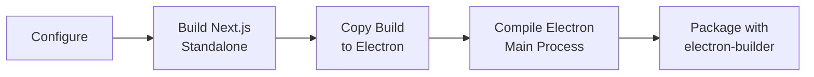

# Desktop Application

Ever Teams provides an Electron-based desktop application that wraps the web frontend into a native desktop experience.

## Architecture

The desktop distribution uses two repos/apps:

1. **`apps/server-web`** — The Electron shell that bundles and serves the Next.js web app
2. **`apps/desktop`** — Desktop-specific resources (i18n translations, icons)

The Electron app packages the pre-built Next.js standalone output and serves it locally, giving users a native desktop application experience.

## Key Details

| Property      | Value                                                     |
| ------------- | --------------------------------------------------------- |
| **Shell**     | Electron                                                  |
| **Frontend**  | Next.js (same as web)                                     |
| **Builder**   | electron-builder                                          |
| **Platforms** | Windows (x64, ARM64), macOS (Intel, Apple Silicon), Linux |

## Features

All web application features plus:

- ✅ System tray integration
- ✅ Auto-start on login
- ✅ Native notifications
- ✅ Offline resilience (serves locally)
- ✅ Auto-update support

## Building

```bash
# Full build pipeline
yarn build:server-web

# Platform-specific packaging
yarn package:server-web:mac    # macOS
yarn package:server-web:win    # Windows
yarn package:server-web:linux  # Linux
```

### Build Pipeline



## CI/CD

Desktop builds are automated via GitHub Actions:

- `desktop-server-web.apps.yml` — Main desktop build
- `desktop-server-api.apps.yml` — API server build
- `desktop.apps.yml` — General desktop workflows

Builds produce installers for:

- Windows: `.exe` (NSIS installer)
- macOS: `.dmg` (signed and notarized)
- Linux: `.AppImage`, `.deb`

## Project Structure

```
apps/server-web/
├── src/
│   ├── main/           # Electron main process
│   │   ├── index.ts    # Main entry point
│   │   ├── menu.ts     # Application menu
│   │   ├── tray.ts     # System tray
│   │   └── updater.ts  # Auto-update logic
│   ├── renderer/       # Settings UI renderer
│   └── preload/        # Context bridge scripts
├── assets/             # App icons and resources
├── release/            # Build output directory
└── package.json        # Electron dependencies and scripts
```
