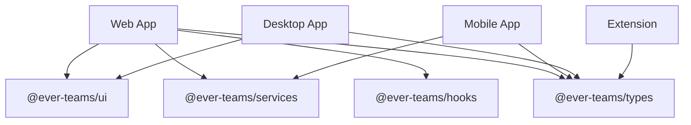

# Applications

Ever Teams is available across multiple platforms. Each application is a separate project within the monorepo.

## Platform Overview

| App                                   | Path                               | Technology            | Status        |
| ------------------------------------- | ---------------------------------- | --------------------- | ------------- |
| **[Web Application](./web)**          | `apps/web`                         | Next.js 16 (React 19) | ✅ Production |
| **[Mobile App](./mobile)**            | `apps/mobile`                      | Expo (React Native)   | ✅ Production |
| **[Desktop App](./desktop)**          | `apps/desktop` + `apps/server-web` | Electron              | ✅ Production |
| **[Browser Extension](./extensions)** | `apps/extensions`                  | Plasmo                | ✅ Production |
| **[Server Web](./server-web)**        | `apps/server-web`                  | Electron + Next.js    | ✅ Production |

## Shared Code

All applications share code through the `packages/` directory:

