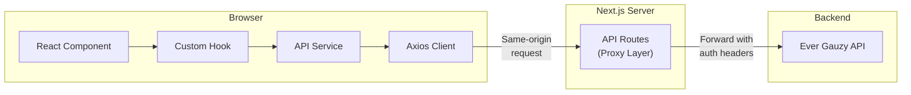

# API Layer

Ever Teams uses a multi-layered API architecture to communicate with the Ever Gauzy backend. This page explains the proxy layer, service clients, and error handling patterns.

## Architecture Overview



## API Proxy Layer

The Next.js API routes (`apps/web/app/api/`) act as a proxy between the frontend and the Ever Gauzy backend:

### Why Use a Proxy?

| Reason                  | Details                                                           |
| ----------------------- | ----------------------------------------------------------------- |
| **No CORS issues**      | Frontend makes same-origin requests to `/api/*`                   |
| **Server-side auth**    | Auth tokens are injected server-side, never exposed to the client |
| **Error normalization** | Consistent error format for all API responses                     |
| **Rate limiting**       | Server-side rate limiting can be applied                          |
| **Caching**             | Response caching at the proxy layer                               |

### Proxy Implementation

Each API route handler follows this pattern:

```typescript
// app/api/tasks/[id]/route.ts
import { authenticatedFetch } from "@/core/services/server/fetch";

export async function GET(
  req: Request,
  { params }: { params: { id: string } },
) {
  return authenticatedFetch(`/tasks/${params.id}`, {
    method: "GET",
    headers: req.headers,
  });
}

export async function PUT(
  req: Request,
  { params }: { params: { id: string } },
) {
  const body = await req.json();
  return authenticatedFetch(`/tasks/${params.id}`, {
    method: "PUT",
    body: JSON.stringify(body),
    headers: req.headers,
  });
}
```

## Client-Side API Services

### Axios Configuration

The API client is built on **Axios** (`core/services/client/axios.ts`):

- Base URL configured from environment variables
- Request/response interceptors for auth token injection
- Automatic retry logic
- Error transformation

### Service Layer

Services in `core/services/client/` provide typed API methods:

```typescript
// Example: Task Service
export const taskService = {
  getAll: (params: TaskQueryParams) =>
    apiClient.get<PaginatedResult<Task>>("/tasks", { params }),

  getById: (id: string) => apiClient.get<Task>(`/tasks/${id}`),

  create: (data: CreateTaskDTO) => apiClient.post<Task>("/tasks", data),

  update: (id: string, data: UpdateTaskDTO) =>
    apiClient.put<Task>(`/tasks/${id}`, data),

  delete: (id: string) => apiClient.delete(`/tasks/${id}`),
};
```

### API Factory

The `api-factory.ts` provides a generic factory for creating service instances:

```typescript
import { createApiFactory } from "@/core/services/client/api-factory";

const taskApi = createApiFactory<Task>("/tasks");
// Provides: taskApi.get(), taskApi.getById(), taskApi.create(), etc.
```

## Server-Side Services

For API routes and server components, Ever Teams provides server-side fetch utilities in `core/services/server/`:

| Module           | Purpose                                     |
| ---------------- | ------------------------------------------- |
| `fetch.ts`       | Authenticated fetch wrapper for Gauzy API   |
| `livekitroom.ts` | LiveKit token generation for video meetings |
| `recaptcha.ts`   | reCAPTCHA verification                      |

## Error Handling

### API Error Service

The `api-error.service.ts` provides centralized error handling:

```typescript
// Errors are caught and normalized
try {
  const response = await taskService.create(data);
  return response;
} catch (error) {
  // APIError provides structured error information
  const apiError = parseApiError(error);
  // { status: 400, message: 'Validation failed', errors: [...] }
}
```

### Error Patterns

| Pattern                 | Usage                                            |
| ----------------------- | ------------------------------------------------ |
| **Toast notifications** | User-facing validation errors                    |
| **Error boundaries**    | Unrecoverable rendering errors                   |
| **Retry logic**         | Transient network failures                       |
| **Logging**             | Server-side error logging via the logger service |

## Logging System

Ever Teams includes a comprehensive logging system (`core/services/logs/`):

| Module                      | Purpose                                  |
| --------------------------- | ---------------------------------------- |
| `logger.service.ts`         | Core logging abstraction                 |
| `logger-client.ts`          | Browser-side logging                     |
| `logger-server.ts`          | Server-side file logging                 |
| `logger-adapter.service.ts` | Logging adapter pattern                  |
| `fs-utils.ts`               | File system utilities for log management |

Configuration options:

- `ACTIVE_LOCAL_LOG_SYSTEM` — Enable/disable local logging
- `LOG_FOLDER_MAX_SIZE` — Maximum log folder size in MB
