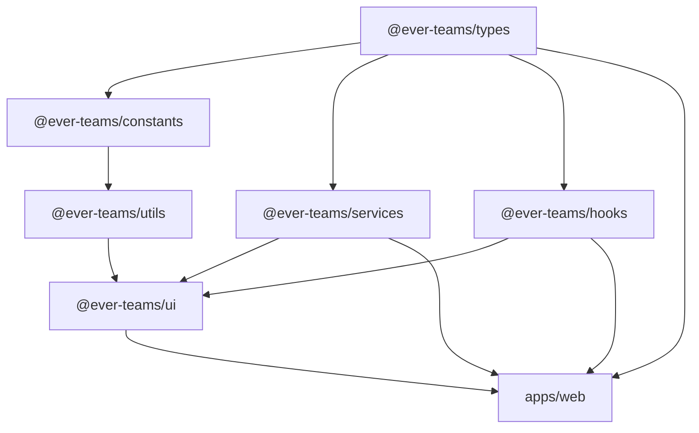

# Monorepo Structure

Ever Teams uses a **monorepo** architecture managed by Yarn Workspaces, NX, Turborepo, and Lerna. This approach enables code sharing across applications while maintaining independent deployability.

## Directory Layout

```
ever-teams/
├── apps/                          # Applications
│   ├── web/                       # Next.js web application (main)
│   ├── mobile/                    # Expo React Native mobile app
│   ├── desktop/                   # Electron desktop app (i18n resources)
│   ├── extensions/                # Plasmo browser extension
│   ├── server-api/                # API server configuration
│   ├── server-web/                # Electron-based web server
│   └── playground/                # Component playground / dev sandbox
│
├── packages/                      # Shared libraries
│   ├── ui/                        # @ever-teams/ui — Shared UI components
│   ├── services/                  # @ever-teams/services — API service layer
│   ├── hooks/                     # @ever-teams/hooks — Shared React hooks
│   ├── types/                     # @ever-teams/types — TypeScript type definitions
│   ├── constants/                 # @ever-teams/constants — Shared constants
│   ├── utils/                     # @ever-teams/utils — Utility functions
│   ├── eslint-config/             # @ever-teams/eslint-config — Shared ESLint config
│   └── ts-config/                 # @ever-teams/ts-config — Shared TypeScript config
│
├── tools/                         # Build and development utilities
│   ├── web/                       # Web build post-install scripts
│   └── electron/                  # Electron build post-install scripts
│
├── .github/                       # GitHub configuration
│   ├── workflows/                 # CI/CD GitHub Actions (34 workflows)
│   ├── ISSUE_TEMPLATE/            # Issue templates
│   ├── CONTRIBUTING.MD            # Contributing guidelines
│   └── PULL_REQUEST_TEMPLATE.md   # PR template
│
├── .deploy/                       # Docker build definitions
├── .scripts/                      # Build and configuration scripts
├── .circleci/                     # CircleCI configuration
│
├── docker-compose.yml             # Production Docker Compose
├── docker-compose.demo.yml        # Demo configuration
├── docker-compose.dev.yml         # Development configuration
├── docker-compose.build.yml       # Build-from-source configuration
├── docker-compose.infra.yml       # Infrastructure services only
│
├── nx.json                        # NX workspace configuration
├── turbo.json                     # Turborepo configuration
├── lerna.json                     # Lerna configuration
├── tsconfig.base.json             # Root TypeScript configuration
├── package.json                   # Root package with workspace scripts
└── yarn.lock                      # Dependency lockfile
```

## Applications (`apps/`)

### `apps/web` — Web Application

The primary application. Built with **Next.js** (v16) using the App Router.

```
apps/web/
├── app/                   # Next.js App Router pages
│   ├── [locale]/          # Internationalized routes
│   │   ├── (main)/        # Main authenticated layout
│   │   │   ├── (teams)/   # Team-scoped pages
│   │   │   ├── board/     # Board view
│   │   │   ├── calendar/  # Calendar view
│   │   │   ├── dashboard/ # Dashboard view
│   │   │   ├── kanban/    # Kanban board
│   │   │   ├── meet/      # Video conferencing
│   │   │   ├── projects/  # Project management
│   │   │   ├── reports/   # Reporting views
│   │   │   ├── settings/  # Application settings
│   │   │   └── task/      # Task detail view
│   │   └── auth/          # Authentication pages
│   └── api/               # API route handlers (proxy)
├── core/                  # Core application logic
│   ├── components/        # React components (~690 files)
│   ├── hooks/             # Custom hooks (~135 hooks)
│   ├── services/          # API services
│   ├── stores/            # Recoil state stores (~47 stores)
│   ├── types/             # TypeScript types
│   ├── lib/               # Libraries and utilities
│   ├── constants/         # App-level constants
│   └── query/             # Query utilities
├── locales/               # Translation files (13 languages)
├── styles/                # Global CSS / Tailwind
├── assets/                # Static assets (images, fonts)
└── public/                # Public static files
```

### `apps/mobile` — Mobile Application

Built with **Expo** and **React Native** using the [Ignite](https://github.com/infinitered/ignite) boilerplate.

```
apps/mobile/
├── app/                   # Application screens and navigation
│   ├── components/        # Mobile-specific components
│   ├── models/            # MobX-State-Tree models
│   ├── navigators/        # React Navigation setup
│   ├── screens/           # Screen components
│   ├── services/          # API services
│   └── theme/             # Theming and styling
├── assets/                # Images and fonts
├── detox/                 # E2E testing configuration
└── test/                  # Unit tests
```

### `apps/server-web` — Electron Web Server

A standalone **Electron** application that bundles and serves the Next.js web frontend. This allows users to run Ever Teams as a desktop application without Internet access to the web app.

```
apps/server-web/
├── src/
│   ├── main/              # Electron main process
│   ├── renderer/          # Electron renderer (settings UI)
│   └── preload/           # Preload scripts
├── assets/                # Application icons and resources
└── release/               # Build output
```

### `apps/extensions` — Browser Extension

Built with **Plasmo**, targeting Chrome and Firefox:

```
apps/extensions/
├── background.ts          # Service worker
├── popup.tsx              # Extension popup UI
├── content.tsx            # Content script
├── components/            # UI components
├── hooks/                 # Extension-specific hooks
├── typescript/            # TypeScript utilities
└── misc/                  # Miscellaneous utilities
```

## Shared Packages (`packages/`)

| Package                  | npm Name                    | Description                                   |
| ------------------------ | --------------------------- | --------------------------------------------- |
| `packages/ui`            | `@ever-teams/ui`            | Shared UI component library (shadcn/ui based) |
| `packages/services`      | `@ever-teams/services`      | API client services for backend communication |
| `packages/hooks`         | `@ever-teams/hooks`         | Reusable React hooks                          |
| `packages/types`         | `@ever-teams/types`         | TypeScript type definitions                   |
| `packages/constants`     | `@ever-teams/constants`     | Shared constants and enums                    |
| `packages/utils`         | `@ever-teams/utils`         | Utility functions                             |
| `packages/eslint-config` | `@ever-teams/eslint-config` | Shared ESLint configuration                   |
| `packages/ts-config`     | `@ever-teams/ts-config`     | Shared TypeScript compiler options            |

## Build System

### Turborepo

The primary build orchestrator. Configured in `turbo.json`:

```json
{
  "pipeline": {
    "build": {
      "dependsOn": ["^build"],
      "outputs": ["dist/**", ".next/**"]
    },
    "dev": {
      "cache": false,
      "persistent": true
    },
    "start": {
      "dependsOn": ["build"]
    }
  }
}
```

### NX

Used for workspace-level orchestration and dependency graph analysis. Configuration in `nx.json`.

### Build Order

The build system respects package dependencies:



## Workspace Configuration

The workspace is defined in the root `package.json`:

```json
{
  "workspaces": {
    "packages": [
      "apps/web",
      "apps/server-web",
      "apps/playground",
      "packages/*",
      "libs/*",
      "tools"
    ]
  }
}
```

## Key Files

| File                 | Purpose                                  |
| -------------------- | ---------------------------------------- |
| `package.json`       | Root workspace configuration and scripts |
| `nx.json`            | NX workspace settings                    |
| `turbo.json`         | Turborepo pipeline configuration         |
| `lerna.json`         | Lerna versioning configuration           |
| `tsconfig.base.json` | Root TypeScript config (path aliases)    |
| `.eslintrc.json`     | Root ESLint configuration                |
| `.prettierrc`        | Prettier formatting rules                |
