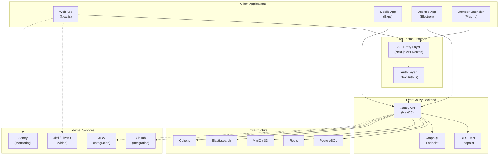
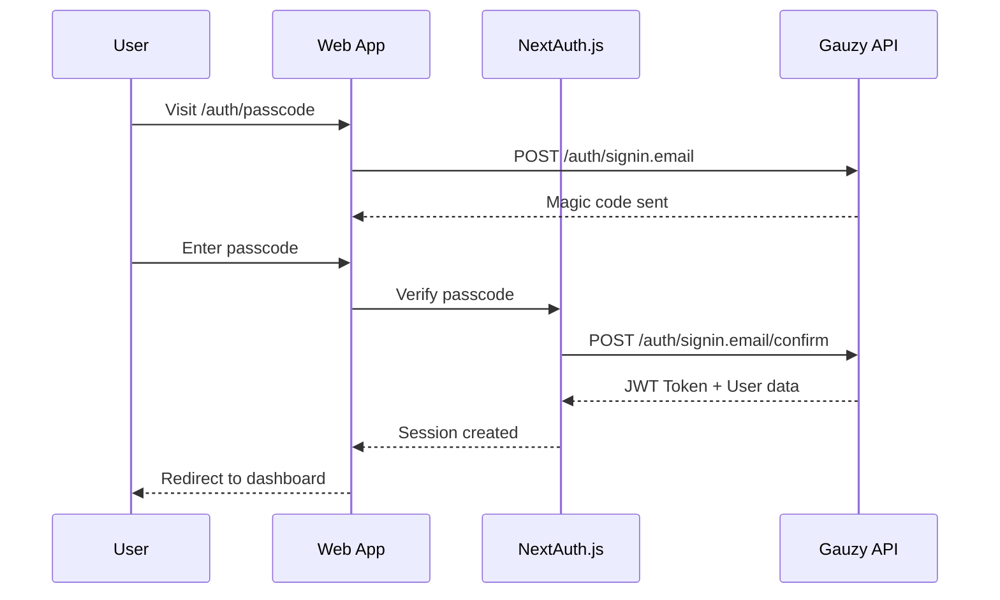
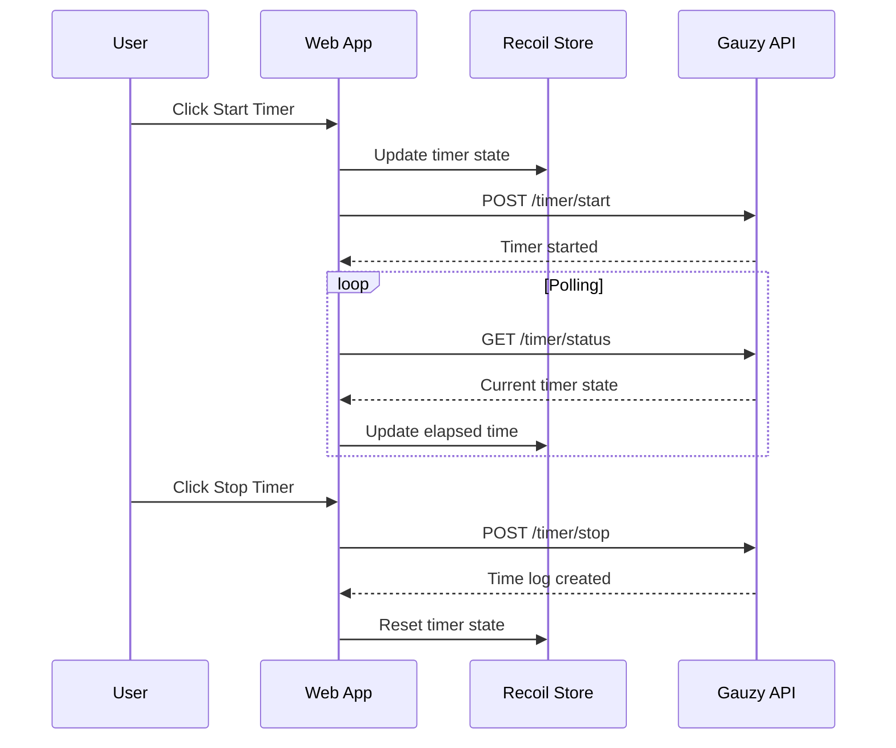
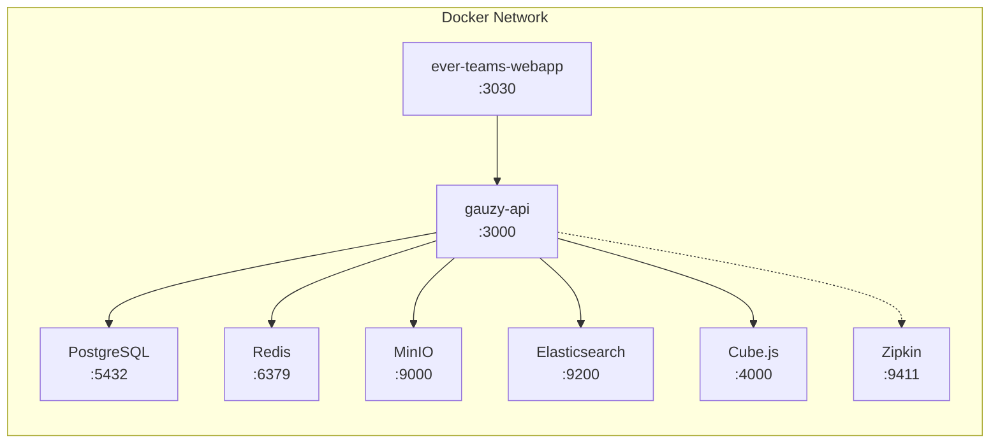

# System Overview

Ever Teams is a modern, full-stack, cross-platform application built with industry-standard open-source technologies. This page provides a high-level view of the system architecture.

## Technology Stack

### Frontend

| Technology                                         | Usage                                                 |
| -------------------------------------------------- | ----------------------------------------------------- |
| **[Next.js](https://nextjs.org)** (v16)            | Server-side rendering, file-based routing, API routes |
| **[React](https://reactjs.org)** (v19)             | UI component library                                  |
| **[Tailwind CSS](https://tailwindcss.com)**        | Utility-first CSS framework                           |
| **[shadcn/ui](https://ui.shadcn.com)**             | Accessible, customizable component primitives         |
| **[Radix UI](https://www.radix-ui.com)**           | Headless UI component library                         |
| **[HeadlessUI](https://headlessui.com)**           | Unstyled, accessible UI components                    |
| **[Recoil](https://recoiljs.org)**                 | State management for React                            |
| **[next-intl](https://next-intl-docs.vercel.app)** | Internationalization (13+ locales)                    |
| **[Sentry](https://sentry.io)**                    | Error tracking and performance monitoring             |

### Mobile

| Technology                                  | Usage                                      |
| ------------------------------------------- | ------------------------------------------ |
| **[React Native](https://reactnative.dev)** | Cross-platform mobile framework            |
| **[Expo](https://expo.dev)**                | Development toolchain and managed workflow |

### Desktop

| Technology                                 | Usage                     |
| ------------------------------------------ | ------------------------- |
| **[Electron](https://www.electronjs.org)** | Desktop application shell |

### Browser Extensions

| Technology                           | Usage                       |
| ------------------------------------ | --------------------------- |
| **[Plasmo](https://www.plasmo.com)** | Browser extension framework |

### Build & Tooling

| Technology                                                     | Usage                             |
| -------------------------------------------------------------- | --------------------------------- |
| **[NX](https://nx.dev)**                                       | Monorepo build orchestration      |
| **[Turborepo](https://turbo.build)**                           | Build system and caching          |
| **[Lerna](https://lerna.js.org)**                              | Package versioning and publishing |
| **[Yarn Workspaces](https://yarnpkg.com/features/workspaces)** | Dependency management             |
| **[TypeScript](https://www.typescriptlang.org)**               | Type-safe JavaScript              |

### Backend (Ever Gauzy API)

Ever Teams relies on the [Ever Gauzy](https://github.com/ever-co/ever-gauzy) platform for its backend:

| Technology                                   | Usage                        |
| -------------------------------------------- | ---------------------------- |
| **[NestJS](https://nestjs.com)**             | Server framework             |
| **[PostgreSQL](https://www.postgresql.org)** | Primary database             |
| **[Redis](https://redis.io)**                | Caching and pub/sub          |
| **[MinIO](https://min.io)**                  | S3-compatible object storage |
| **[Elasticsearch](https://www.elastic.co)**  | Full-text search             |
| **[Cube.js](https://cube.dev)**              | Analytics / OLAP engine      |

## System Architecture

## Data Flow

### Authentication Flow

### Timer Flow

## Deployment Architecture

### Docker Compose (Production)

## Key Design Decisions

| Decision                          | Rationale                                                                |
| --------------------------------- | ------------------------------------------------------------------------ |
| **Next.js API proxy**             | Avoids CORS issues, keeps API keys server-side, enables middleware       |
| **Recoil for state**              | Fine-grained subscriptions, async selectors, atom-based architecture     |
| **Monorepo with shared packages** | Code reuse across web, mobile, and desktop apps                          |
| **Ever Gauzy as backend**         | Leverages a mature ERP/CRM/HRM platform instead of building from scratch |
| **Docker Compose for infra**      | One-command deployment of all required services                          |
| **TypeScript everywhere**         | Type safety across the full stack                                        |
