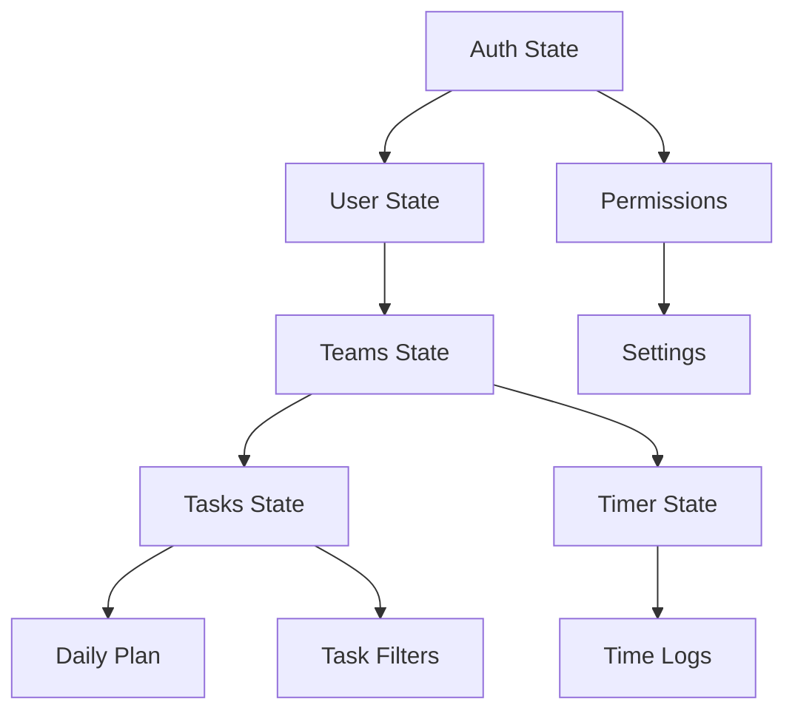

# State Management

Ever Teams uses **[Recoil](https://recoiljs.org)** for global state management. Recoil provides fine-grained subscriptions, async data fetching via selectors, and an atom-based architecture that integrates naturally with React.

## Why Recoil?

| Feature           | Benefit                                                                                         |
| ----------------- | ----------------------------------------------------------------------------------------------- |
| **Atom-based**    | Each piece of state is independent — components only re-render when their specific atoms change |
| **Derived state** | Selectors compute derived state efficiently                                                     |
| **Async support** | Built-in async selectors for API data fetching                                                  |
| **React-native**  | Hooks-first API (`useRecoilState`, `useRecoilValue`)                                            |

## Store Organization

State stores are organized by domain in `core/stores/`:

```
core/stores/
├── index.ts                         # Re-exports all stores
│
├── auth/                            # Authentication state
│   ├── index.ts
│   ├── permission.ts                # User permissions
│   └── workspaces.ts                # Workspace list
│
├── common/                          # Shared application state
│   ├── currencies.ts                # Currency data
│   ├── data-sync.ts                 # Data synchronization flags
│   ├── full-width.ts                # Layout width toggle
│   ├── header-tabs.ts               # Navigation tab state
│   ├── languages.ts                 # Language/locale state
│   ├── menu.ts                      # Sidebar menu state
│   ├── public.ts                    # Public page state
│   ├── setting.ts                   # Application settings
│   └── timezones.ts                 # Timezone data
│
├── tasks/                           # Task management state
│   ├── task-filter.ts               # Active filters
│   ├── task-optimistic-updates.ts   # Optimistic UI updates
│   └── task-timesheet.ts            # Task-timesheet associations
│
├── teams/                           # Team state
│   ├── all-teams.ts                 # All teams list
│   ├── collaborative.ts             # Collaborative mode state
│   ├── organization-team.ts         # Current team details
│   └── team-tasks.ts               # Team's task list
│
├── timer/                           # Timer state
│   ├── active-timer.ts              # Currently running timer
│   ├── activity-type.ts             # Activity type selection
│   ├── time-limits.ts               # Time limit configuration
│   ├── time-logs.ts                 # Time log records
│   ├── time-slot.ts                 # Time slot data
│   └── timer.ts                     # Timer control state
│
├── user/                            # User state
│   ├── avatar.ts                    # User avatar
│   ├── employee.ts                  # Employee profile
│   ├── user-organizations.ts        # User's organizations
│   └── user.ts                      # Current user
│
├── daily-plan/                      # Daily planning state
│   └── daily-plan.ts                # Daily plan data
│
├── integrations/                    # Integration state
│   ├── integration.ts               # Active integrations
│   ├── integration-github.ts        # GitHub integration state
│   ├── integration-tenant.ts        # Tenant integration settings
│   └── integration-types.ts         # Integration type definitions
│
├── time-logs.ts                     # Top-level time log state
├── all-plans-modal.ts               # Plans modal state
├── assign-task-modal.ts             # Task assignment modal
└── project-action-modal.ts          # Project action modal
```

## Common Patterns

### Basic Atom

```typescript
import { atom } from "recoil";

export const timerRunningState = atom<boolean>({
  key: "timerRunningState",
  default: false,
});
```

### Using Atoms in Components

```typescript
import { useRecoilState, useRecoilValue } from 'recoil';
import { timerRunningState } from '@/core/stores';

function TimerButton() {
  const [isRunning, setIsRunning] = useRecoilState(timerRunningState);

  return (
    <button onClick={() => setIsRunning(!isRunning)}>
      {isRunning ? 'Stop' : 'Start'}
    </button>
  );
}
```

### Hook + Store Pattern

The recommended pattern in Ever Teams is to use a **custom hook** that encapsulates store access and API calls:

```typescript
// core/hooks/activities/use-timer.ts
export function useTimer() {
  const [isRunning, setIsRunning] = useRecoilState(timerRunningState);
  const [timerData, setTimerData] = useRecoilState(timerState);

  const startTimer = useCallback(async () => {
    setIsRunning(true); // Optimistic update
    await startTimerAPI();
  }, []);

  const stopTimer = useCallback(async () => {
    setIsRunning(false);
    const result = await stopTimerAPI();
    setTimerData(result);
  }, []);

  return { isRunning, timerData, startTimer, stopTimer };
}
```

### Optimistic Updates

For responsive UI, Ever Teams uses optimistic updates in stores like `task-optimistic-updates.ts`:

```typescript
// Update state immediately, then sync with server
const taskOptimisticState = atom({
  key: "taskOptimisticState",
  default: new Map(),
});
```

## State Dependencies



## Data Synchronization

The `common/data-sync.ts` store manages synchronization flags that coordinate data refreshes across components. When one component updates data (e.g., creating a task), the sync flag triggers other components to refetch their data.

## Best Practices

1. **One concern per atom** — Keep atoms focused on a single piece of state.
2. **Use hooks as the interface** — Don't access atoms directly in components; wrap them in custom hooks.
3. **Optimistic updates** — Update the UI immediately, then reconcile with the server response.
4. **Namespace atom keys** — Use descriptive, unique keys to avoid collisions (e.g., `timer/running`, `tasks/filter`).
