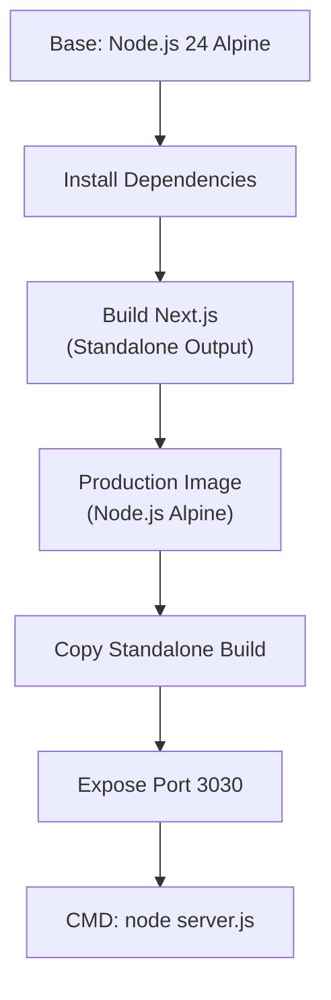

# DevOps & CI/CD

Ever Teams uses **GitHub Actions** for continuous integration and continuous deployment, with **Docker** for containerized builds and deployments.

## GitHub Actions Workflows

The project includes **34 GitHub Actions workflows** in `.github/workflows/`:

### Web Application

| Workflow                       | Trigger           | Description                            |
| ------------------------------ | ----------------- | -------------------------------------- |
| `web.before-merge.yml`         | PR                | Lint, type-check, and build validation |
| `deploy-vercel-dev.yml`        | Push to `develop` | Deploy to Vercel (dev)                 |
| `deploy-vercel-stage.yml`      | Push to `stage`   | Deploy to Vercel (staging)             |
| `deploy-vercel-prod.yml`       | Push to `main`    | Deploy to Vercel (production)          |
| `deploy-do-dev/stage/prod.yml` | Push to branches  | Deploy to DigitalOcean                 |
| `deploy-render-dev.yml`        | Push to `develop` | Deploy to Render                       |

### Docker

| Workflow                         | Trigger           | Description                              |
| -------------------------------- | ----------------- | ---------------------------------------- |
| `docker-build-publish-dev.yml`   | Push to `develop` | Build and push Docker image (dev tag)    |
| `docker-build-publish-stage.yml` | Push to `stage`   | Build and push Docker image (stage tag)  |
| `docker-build-publish-prod.yml`  | Push to `main`    | Build and push Docker image (latest tag) |

### Desktop

| Workflow                      | Trigger        | Description                         |
| ----------------------------- | -------------- | ----------------------------------- |
| `desktop.apps.yml`            | Release/manual | Build desktop app for all platforms |
| `desktop-server-web.apps.yml` | Release/manual | Build server-web Electron app       |
| `desktop-server-api.apps.yml` | Release/manual | Build server-api Electron app       |

### Mobile

| Workflow                        | Trigger              | Description                |
| ------------------------------- | -------------------- | -------------------------- |
| `mobile.apps.ios.yml`           | Release              | Build iOS app              |
| `mobile.apps.android.yml`       | Release              | Build Android app          |
| `mobile.apps.stage.ios.yml`     | Push to `stage`      | Build iOS staging app      |
| `mobile.apps.stage.android.yml` | Push to `stage`      | Build Android staging app  |
| `mobile.before-merge.yml`       | PR                   | Mobile build validation    |
| `mobile.dev/stage/prod.yml`     | Environment branches | Mobile CI for environments |

### Extensions

| Workflow              | Trigger           | Description                   |
| --------------------- | ----------------- | ----------------------------- |
| `extensions.dev.yml`  | Push to `develop` | Build browser extension (dev) |
| `extensions.prod.yml` | Push to `main`    | Build and publish extension   |

### Releases

| Workflow            | Trigger           | Description         |
| ------------------- | ----------------- | ------------------- |
| `release.dev.yml`   | Push to `develop` | Development release |
| `release.stage.yml` | Push to `stage`   | Staging release     |
| `release.prod.yml`  | Push to `main`    | Production release  |
| `release.apps.yml`  | Manual/tag        | Full app release    |

### Quality

| Workflow           | Trigger | Description                       |
| ------------------ | ------- | --------------------------------- |
| `typos.yml`        | PR      | Check for typos in code           |
| `knip-cleanup.yml` | Manual  | Find unused code and dependencies |

## Docker Build Pipeline

### Dockerfile

The web app Dockerfile is at `.deploy/web/Dockerfile`:



### Docker Compose Configurations

| File                       | Use Case                                     |
| -------------------------- | -------------------------------------------- |
| `docker-compose.yml`       | Full production stack (API + webapp + infra) |
| `docker-compose.demo.yml`  | Quick demo with pre-built images             |
| `docker-compose.dev.yml`   | Development with hot-reload                  |
| `docker-compose.build.yml` | Build everything from source                 |
| `docker-compose.infra.yml` | Infrastructure services only                 |

### Container Registry

Images are published to:

- **GitHub Container Registry**: `ghcr.io/ever-co/`
- **Docker Hub**: `everco/`

## Release Process

### Branching Strategy

```mermaid
gitgraph
    commit
    branch develop
    checkout develop
    commit
    commit
    branch feature
    checkout feature
    commit
    commit
    checkout develop
    merge feature
    checkout main
    merge develop tag: "v0.1.0"
    checkout develop
    commit
```

| Branch      | Purpose             | Deploys To  |
| ----------- | ------------------- | ----------- |
| `main`      | Production releases | Production  |
| `stage`     | Staging / QA        | Staging     |
| `develop`   | Active development  | Development |
| `feature/*` | Feature branches    | PR previews |

### Semantic Versioning

Releases follow [Semantic Versioning](https://semver.org/) with [Conventional Commits](https://www.conventionalcommits.org/):

- `feat:` → minor version bump
- `fix:` → patch version bump
- `BREAKING CHANGE:` → major version bump

Tools: `semantic-release`, `commitizen`, `commitlint`

## Environment Management

| Environment     | Branch    | API                 | URL               |
| --------------- | --------- | ------------------- | ----------------- |
| **Production**  | `main`    | `api.ever.team`     | `app.ever.team`   |
| **Staging**     | `stage`   | `apistage.gauzy.co` | `stage.ever.team` |
| **Development** | `develop` | `apidev.ever.team`  | dev deployment    |

## CI/CD Infrastructure

### Self-Hosted Runners

Ever Teams uses both GitHub-hosted and self-hosted runners:

- **GitHub-hosted**: Linux (Ubuntu) for web and Docker builds
- **Self-hosted**: Windows x64 and ARM64 for Electron desktop builds
- **macOS**: For iOS and macOS desktop builds

### Caching

| Cache Type            | Provider              |
| --------------------- | --------------------- |
| **NX Cache**          | NX Cloud              |
| **Yarn dependencies** | `actions/cache`       |
| **Docker layers**     | Docker BuildKit cache |
| **Next.js build**     | `.next/cache`         |
