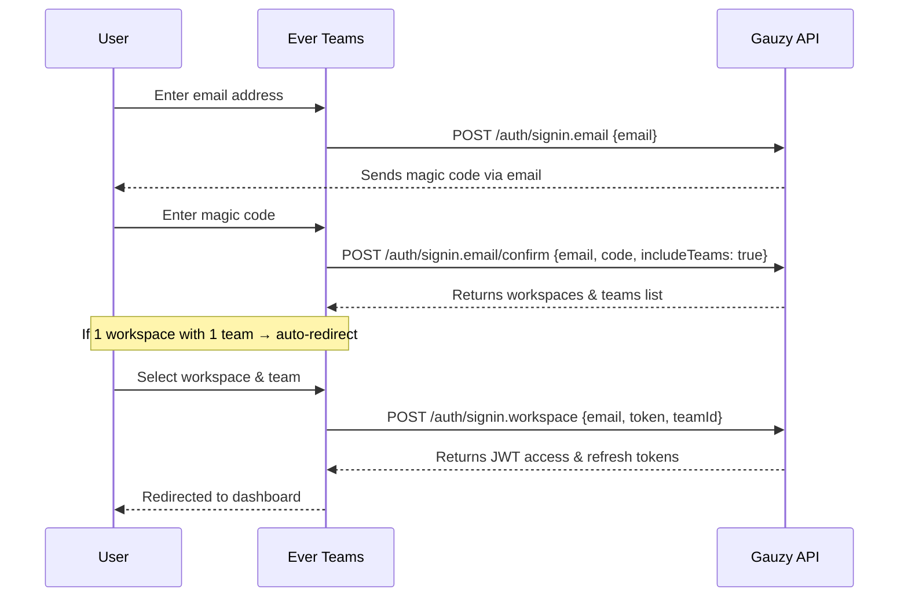
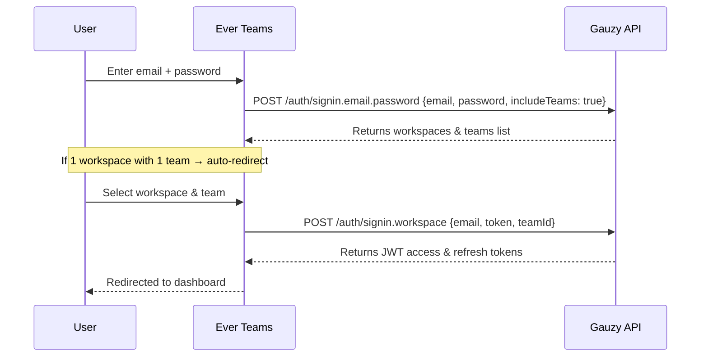
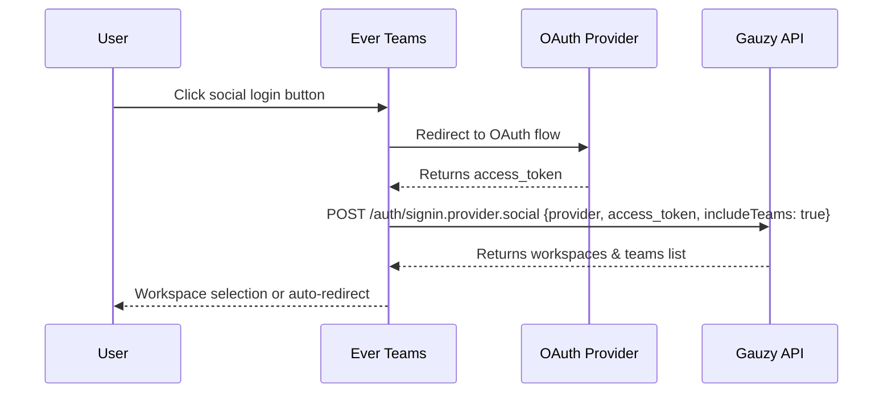
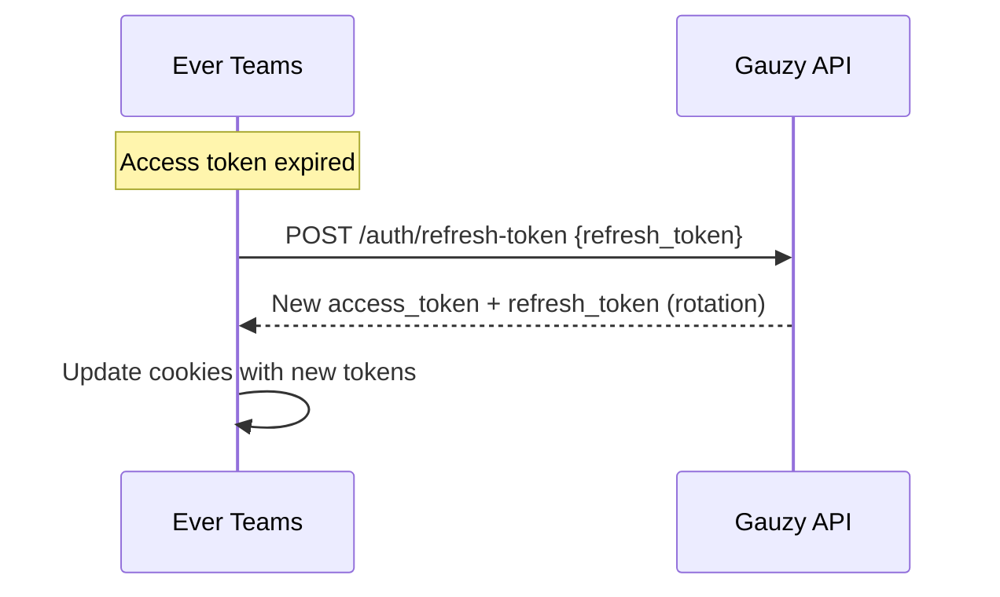

# Authentication

Ever Teams supports multiple authentication methods, all powered by the [Ever Gauzy API](https://github.com/ever-co/ever-gauzy) backend. This page covers the available auth flows, their implementation, and how they work together.

## Authentication Methods

| Method              | Description                             | Use Case                                |
| ------------------- | --------------------------------------- | --------------------------------------- |
| **Magic Code**      | Email-based passwordless authentication | Default login flow — no password needed |
| **Password**        | Traditional email + password login      | Users who prefer password-based auth    |
| **Social / OAuth**  | Google, GitHub, Facebook, Twitter SSO   | Single sign-on convenience              |
| **Forgot Password** | Email-based password reset flow         | Recovering account access               |
| **Invite Code**     | Team invitation via emailed code        | Joining an existing team by invitation  |

## Magic Code (Passwordless) Login

This is the **default** login flow. Users enter their email, receive a magic code, and enter it to authenticate — no password required.

### Flow

### Key Files

| File                                                     | Purpose                                            |
| -------------------------------------------------------- | -------------------------------------------------- |
| `app/[locale]/auth/passcode/page.tsx`                    | Route entry point                                  |
| `core/components/pages/auth/passcode/page-component.tsx` | Main passcode UI component                         |
| `core/hooks/auth/use-authentication-passcode.ts`         | Hook managing passcode auth state                  |
| `core/services/client/api/auth/auth.service.ts`          | API service (`sendAuthCode`, `signInEmailConfirm`) |

### Code Length

The magic code is **8 characters** long. This is defined by the `AUTH_CODE_LENGTH` constant in `core/constants/config/constants.tsx` and used consistently across all auth components.

## Password Login

Users enter their email and password to authenticate.

### Flow

### Key Files

| File                                                     | Purpose                             |
| -------------------------------------------------------- | ----------------------------------- |
| `app/[locale]/auth/password/page.tsx`                    | Route entry point                   |
| `core/components/pages/auth/password/page-component.tsx` | Login form with password toggle     |
| `core/hooks/auth/use-authentication-password.ts`         | Hook managing password auth state   |
| `core/services/client/api/auth/auth.service.ts`          | API service (`signInEmailPassword`) |

## Forgot / Reset Password

When a user forgets their password, they can request a reset link via email. See the dedicated [Forgot Password](./forgot-password) page for full details.

### Quick Summary

1. User clicks **"Forgot Password?"** on the password login page
2. Enters their email on `/auth/forgot-password`
3. API sends a reset email with a tokenized link
4. User clicks the link, lands on `/auth/reset-password?token=...`
5. Enters and confirms new password
6. Password updated — redirect to login

## Social / OAuth Login

Supports SSO via Google, GitHub, Facebook, and Twitter.

### Flow

### Key Files

| File                                             | Purpose                                |
| ------------------------------------------------ | -------------------------------------- |
| `core/components/auth/social-logins-buttons.tsx` | Social login button components         |
| `core/services/client/api/auth/auth.service.ts`  | API service (`signInEmailSocialLogin`) |

## Registration / Sign Up

New users can create an account and optionally create their first team.

### Flow

1. User navigates to `/auth/signup`
2. Enters name, email, and team name (optional)
3. API creates the user account and team
4. User is authenticated and redirected to dashboard

### Key Files

| File                                            | Purpose                          |
| ----------------------------------------------- | -------------------------------- |
| `app/[locale]/auth/signup/page.tsx`             | Route entry point                |
| `core/services/client/api/auth/auth.service.ts` | API service (`registerUserTeam`) |

## Token Management

### JWT Tokens

| Token             | Purpose                    | Storage                  |
| ----------------- | -------------------------- | ------------------------ |
| **Access Token**  | Authenticates API requests | Cookie (`access-token`)  |
| **Refresh Token** | Obtains new access tokens  | Cookie (`refresh-token`) |

### Token Refresh Flow

### Key Files

| File                                            | Purpose                 |
| ----------------------------------------------- | ----------------------- |
| `core/services/client/api/auth/auth.service.ts` | `refreshToken()` method |
| `core/lib/helpers/cookies.ts`                   | Token cookie management |

## Workspace Selection

After authentication, if a user belongs to multiple workspaces or teams, they select which one to use. If only one workspace with one team exists, the app **auto-redirects** to the dashboard.

### Key Files

| File                                                     | Purpose                                        |
| -------------------------------------------------------- | ---------------------------------------------- |
| `core/hooks/auth/use-workspace-analysis.ts`              | Analyzes workspace structure for auto-redirect |
| `core/components/pages/auth/passcode/page-component.tsx` | `WorkSpaceComponent`                           |

## Auth Routes Summary

| Route                   | Description                        |
| ----------------------- | ---------------------------------- |
| `/auth/passcode`        | Magic code (passwordless) login    |
| `/auth/password`        | Password login                     |
| `/auth/signup`          | Registration                       |
| `/auth/forgot-password` | Request password reset             |
| `/auth/reset-password`  | Set new password (from email link) |
| `/auth/accept-invite`   | Accept team invitation             |
| `/auth/social-welcome`  | Post-social-login welcome          |
| `/auth/workspace`       | Workspace selector                 |
| `/auth/error`           | Auth error page                    |

## Gauzy API Auth Endpoints

All authentication is powered by the Ever Gauzy API. These are the key endpoints:

| Endpoint                       | Method | Auth   | Description                  |
| ------------------------------ | ------ | ------ | ---------------------------- |
| `/auth/signin.email`           | POST   | Public | Send magic code email        |
| `/auth/signin.email/confirm`   | POST   | Public | Confirm magic code           |
| `/auth/signin.email.password`  | POST   | Public | Sign in with password        |
| `/auth/signin.provider.social` | POST   | Public | Social / OAuth login         |
| `/auth/signin.workspace`       | POST   | Public | Sign into workspace          |
| `/auth/request-password`       | POST   | Public | Request password reset email |
| `/auth/reset-password`         | POST   | Public | Reset password with token    |
| `/auth/refresh-token`          | POST   | Public | Refresh JWT tokens           |
| `/auth/register`               | POST   | Public | Register new account         |
| `/auth/login`                  | POST   | Public | Login with code (mobile)     |

:::tip
All auth endpoints are **public** (no JWT required) and **rate-limited** (typically 3 requests per minute) to prevent abuse.
:::

## Environment Variables

Auth-related environment variables (set in `apps/web/.env.local`):

| Variable                           | Description                         |
| ---------------------------------- | ----------------------------------- |
| `GAUZY_API_SERVER_URL`             | Gauzy API base URL                  |
| `NEXT_PUBLIC_GAUZY_API_SERVER_URL` | Client-side API URL                 |
| `AUTH_SECRET`                      | NextAuth secret (32+ chars)         |
| `INVITE_CALLBACK_URL`              | Callback URL for invitations        |
| `VERIFY_EMAIL_CALLBACK_URL`        | Callback URL for email verification |
| `GOOGLE_APP_CLIENT_ID`             | Google OAuth client ID              |
| `GOOGLE_APP_CLIENT_SECRET`         | Google OAuth client secret          |
| `GITHUB_APP_CLIENT_ID`             | GitHub OAuth client ID              |
| `GITHUB_APP_CLIENT_SECRET`         | GitHub OAuth client secret          |
| `FACEBOOK_APP_CLIENT_ID`           | Facebook OAuth client ID            |
| `FACEBOOK_APP_CLIENT_SECRET`       | Facebook OAuth client secret        |
| `TWITTER_APP_CLIENT_ID`            | Twitter OAuth client ID             |
| `TWITTER_APP_CLIENT_SECRET`        | Twitter OAuth client secret         |

## Service Architecture

The auth service layer is located at `core/services/client/api/auth/`:

| File                | Class / Export  | Purpose                     |
| ------------------- | --------------- | --------------------------- |
| `auth.service.ts`   | `authService`   | Main auth operations        |
| `signin.service.ts` | `signinService` | Workspace sign-in specifics |

The `AuthService` class extends `APIService` and provides methods for all auth operations, automatically routing calls to either the Gauzy API (direct) or the Next.js API proxy layer based on configuration.
