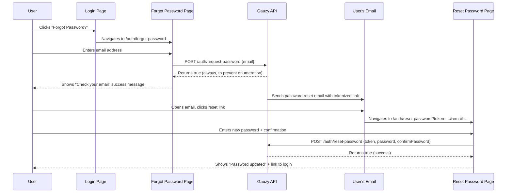

# Forgot Password

Ever Teams provides a complete forgot / reset password flow, powered by the Ever Gauzy API's password reset endpoints. This page documents the full flow, API integration, and implementation details.

## User Flow



## Step 1: Request Password Reset

### Page: `/auth/forgot-password`

The user enters their email address and clicks "Send Reset Link". The app calls the Gauzy API:

```http
POST /auth/request-password
Content-Type: application/json

{
  "email": "user@example.com"
}
```

**Response**: Always returns `true` (even if the email doesn't exist) to prevent user enumeration attacks.

**Server behavior**:

- Looks up all users with the given email (may be in multiple tenants)
- Generates a short-lived JWT token (10-minute expiry) for each user
- Invalidates any existing password reset records for that email
- Sends a password reset email with a link containing the token
- If the user exists in multiple tenants, sends a multi-tenant reset email with links for each tenant

:::info Rate limiting
This endpoint is rate-limited to **3 requests per 60 seconds** to prevent abuse.
:::

### Key Files

| File                                                                  | Purpose                                           |
| --------------------------------------------------------------------- | ------------------------------------------------- |
| `app/[locale]/auth/forgot-password/page.tsx`                          | Route entry point                                 |
| `core/components/pages/auth/forgot-password/forgot-password-form.tsx` | Form component with email input and success state |
| `core/services/client/api/auth/auth.service.ts`                       | `requestPassword()` method                        |

## Step 2: Reset Password

### Page: `/auth/reset-password`

The user arrives via the email link, which includes a `token` query parameter. They enter a new password and confirmation:

```http
POST /auth/reset-password
Content-Type: application/json

{
  "token": "eyJhbGciOiJI...",
  "password": "newSecurePassword123",
  "confirmPassword": "newSecurePassword123"
}
```

**Response**: Returns `true` on success.

**Server behavior**:

- Verifies the JWT token (checks signature, expiry, and purpose)
- Looks up the password reset record in the database
- Validates that the passwords match
- Hashes the new password with bcrypt
- Updates the user's password
- Deletes the password reset record (one-time use)

**Error cases**:

- Expired token (10-minute window)
- Invalid or already-used token
- Passwords don't match
- Password doesn't meet requirements

:::info Rate limiting
This endpoint is also rate-limited to **3 requests per 60 seconds**.
:::

### Client-Side Validation

Before calling the API, the reset form validates:

- Password must be at least 6 characters
- Password and confirmation must match
- Token must be present in the URL

### Key Files

| File                                                                | Purpose                                                 |
| ------------------------------------------------------------------- | ------------------------------------------------------- |
| `app/[locale]/auth/reset-password/page.tsx`                         | Route entry point                                       |
| `core/components/pages/auth/reset-password/reset-password-form.tsx` | Form with password inputs, validation, show/hide toggle |
| `core/services/client/api/auth/auth.service.ts`                     | `resetPassword()` method                                |

## Login Page Integration

A **"Forgot Password?"** link is displayed on the password login page (`/auth/password`), in the `LoginFormActions` component. It appears between the "Don't have an account?" / "Register" row and the "Continue" button.

## Translation Keys

All UI strings are internationalized. The keys are in `locales/en.json`:

| Key                                            | Value                                          |
| ---------------------------------------------- | ---------------------------------------------- |
| `pages.auth.FORGOT_PASSWORD`                   | "Forgot Password?"                             |
| `pages.authForgotPassword.HEADING_TITLE`       | "Forgot Password"                              |
| `pages.authForgotPassword.FORM_DESCRIPTION`    | "Enter the email address..."                   |
| `pages.authForgotPassword.SEND_RESET_LINK`     | "Send Reset Link"                              |
| `pages.authForgotPassword.SUCCESS_TITLE`       | "Check Your Email"                             |
| `pages.authForgotPassword.SUCCESS_MESSAGE`     | "Password reset instructions..."               |
| `pages.authForgotPassword.BACK_TO_LOGIN`       | "Back to Login"                                |
| `pages.authResetPassword.HEADING_TITLE`        | "Reset Password"                               |
| `pages.authResetPassword.NEW_PASSWORD`         | "New Password"                                 |
| `pages.authResetPassword.CONFIRM_PASSWORD`     | "Confirm Password"                             |
| `pages.authResetPassword.RESET_PASSWORD`       | "Reset Password"                               |
| `pages.authResetPassword.SUCCESS_TITLE`        | "Password Updated"                             |
| `pages.authResetPassword.PASSWORDS_DONT_MATCH` | "Passwords don't match"                        |
| `pages.authResetPassword.TOKEN_EXPIRED`        | "This reset link is invalid or has expired..." |

## API Service Methods

The `AuthService` class in `core/services/client/api/auth/auth.service.ts` provides:

```typescript
// Request a password reset email
requestPassword(email: string): Promise<boolean>

// Reset password with a valid token
resetPassword(token: string, password: string, confirmPassword: string): Promise<boolean>
```

Both methods call the Gauzy API directly. No Next.js API proxy routes are needed since these are public endpoints.

## Security Considerations

| Aspect               | Implementation                                                                                |
| -------------------- | --------------------------------------------------------------------------------------------- |
| **User enumeration** | `POST /auth/request-password` always returns `true` regardless of whether the email exists    |
| **Token expiry**     | Reset tokens expire after **10 minutes**                                                      |
| **One-time use**     | Each token can only be used once; previous tokens are invalidated when a new one is generated |
| **Rate limiting**    | Both endpoints limited to 3 requests per minute                                               |
| **Password hashing** | New passwords are hashed with bcrypt before storage                                           |
| **Input validation** | Server-side validation via DTOs with class-validator                                          |
