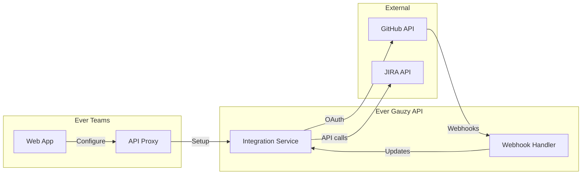

# Integrations

Ever Teams integrates with popular development and project management tools to synchronize work across platforms.

## Available Integrations

### GitHub

The GitHub integration enables bidirectional sync between Ever Teams and GitHub:

| Feature            | Description                               |
| ------------------ | ----------------------------------------- |
| **Issue sync**     | Import GitHub issues as Ever Teams tasks  |
| **PR tracking**    | Track pull request status alongside tasks |
| **Commit linking** | Link commits to tasks automatically       |
| **Webhook sync**   | Real-time updates via GitHub webhooks     |

#### Setup

1. Navigate to **Settings → Integrations**
2. Click **Connect GitHub**
3. Authorize the Ever Teams GitHub App
4. Select repositories to sync
5. Configure sync settings (project mapping, label mapping)

#### Configuration

| Variable                      | Description                 |
| ----------------------------- | --------------------------- |
| `GAUZY_GITHUB_CLIENT_ID`      | GitHub OAuth Client ID      |
| `GAUZY_GITHUB_CLIENT_SECRET`  | GitHub OAuth Client Secret  |
| `GAUZY_GITHUB_APP_ID`         | GitHub App ID               |
| `GAUZY_GITHUB_APP_NAME`       | GitHub App name             |
| `GAUZY_GITHUB_WEBHOOK_URL`    | Webhook endpoint URL        |
| `GAUZY_GITHUB_WEBHOOK_SECRET` | Webhook verification secret |

### JIRA

Import and sync issues from Atlassian JIRA:

| Feature             | Description                              |
| ------------------- | ---------------------------------------- |
| **Issue import**    | Import JIRA issues into Ever Teams       |
| **Status sync**     | Map JIRA statuses to Ever Teams statuses |
| **Project mapping** | Map JIRA projects to Ever Teams projects |

### Other Integrations

| Integration   | Status  | Description                |
| ------------- | ------- | -------------------------- |
| **GitLab**    | Planned | GitLab issue and MR sync   |
| **Bitbucket** | Planned | Bitbucket integration      |
| **Slack**     | Planned | Notifications and commands |

## Integration Architecture

## Related API Routes

| Route                     | Purpose                              |
| ------------------------- | ------------------------------------ |
| `/api/integration`        | List and manage integrations         |
| `/api/integration/[type]` | Type-specific integration operations |
| `/api/integration-tenant` | Tenant-level integration settings    |

## Related Hooks

| Hook                   | Purpose                    |
| ---------------------- | -------------------------- |
| `useIntegration`       | Integration management     |
| `useGitHubIntegration` | GitHub-specific operations |

## Related Stores

| Store                                | Purpose                      |
| ------------------------------------ | ---------------------------- |
| `integrations/integration.ts`        | Active integrations          |
| `integrations/integration-github.ts` | GitHub integration state     |
| `integrations/integration-tenant.ts` | Tenant integration config    |
| `integrations/integration-types.ts`  | Integration type definitions |
