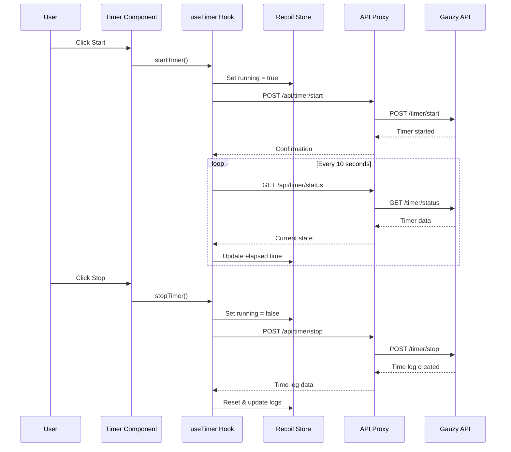

# Time Tracking & Timer

Time tracking is a core feature of Ever Teams. It provides real-time timer controls, activity monitoring, time logs, and productivity metrics.

## Timer

### Starting and Stopping

The timer is the primary time tracking interface:

1. **Select a task** — Choose the task you want to track time against.
2. **Click Start** — The timer begins counting and sends a start signal to the backend.
3. **Work on your task** — The timer runs in the background, tracking elapsed time.
4. **Click Stop** — The timer stops and creates a time log entry.

### Timer Modes

| Mode       | Description                                     |
| ---------- | ----------------------------------------------- |
| **Manual** | Manually enter start/end times for time entries |
| **Timer**  | Real-time timer that tracks seconds as you work |

### Timer Features

- **Optimistic UI** — Timer state updates instantly in the UI before server confirmation
- **Cross-tab sync** — Timer state is synchronized across browser tabs
- **Polling** — Periodic polling ensures timer accuracy and sync
- **Activity tracking** — Records applications and URLs used during tracking (desktop app)

## Time Logs

Time logs are records of tracked time. Each log contains:

| Field              | Description                                                  |
| ------------------ | ------------------------------------------------------------ |
| **Start time**     | When the timer was started                                   |
| **End time**       | When the timer was stopped                                   |
| **Duration**       | Calculated elapsed time                                      |
| **Task**           | Associated task                                              |
| **Project**        | Associated project                                           |
| **Employee**       | The team member who tracked time                             |
| **Source**         | Where the time was tracked (web, desktop, mobile, extension) |
| **Activity level** | Percentage of active time (keyboard/mouse activity)          |

## Time Slots

Time is organized into **slots** (typically 10-minute intervals) that contain:

- Activity level percentage
- Application usage data
- Optional screenshots (desktop app)
- Keyboard and mouse activity metrics

## Activity Tracking

Activity tracking provides insight into how time is spent:

### Activity Types

- **Application tracking** — Records which applications were in focus
- **URL tracking** — Records which websites were visited
- **Screenshot capture** — Periodic screenshots (desktop app only, configurable interval)
- **Idle detection** — Detects when the user is idle and can auto-pause/stop the timer

### Activity Metrics

- **Overall activity** — Percentage of active vs. idle time
- **Application breakdown** — Time spent per application
- **Task activity** — Activity level per task

## Time Limits

Set daily or weekly time limits to manage workload:

| Setting                | Description                        |
| ---------------------- | ---------------------------------- |
| **Daily limit**        | Maximum hours per day              |
| **Weekly limit**       | Maximum hours per week             |
| **Time tracking mode** | How limits are enforced            |
| **Alert threshold**    | Warning when approaching the limit |

## Manual Time Entry

For time that wasn't tracked in real-time:

1. Navigate to the **Timesheets** section
2. Click **Add Time** or **Manual Entry**
3. Select the date, task, and project
4. Enter start and end times (or duration)
5. Add optional notes
6. Submit the entry

## Related Hooks

The following custom hooks power the time tracking features:

| Hook                       | Purpose                                  |
| -------------------------- | ---------------------------------------- |
| `useTimer`                 | Main timer control (start, stop, status) |
| `useTimerPolling`          | Periodic polling for timer sync          |
| `useTimerOptimisticUI`     | Optimistic UI updates for timer state    |
| `useStartStopTimerHandler` | Timer start/stop event handling          |
| `useTimeSlots`             | Time slot data fetching                  |
| `useTimeLogs`              | Time log data management                 |
| `useTimeLimits`            | Time limit configuration                 |
| `useManualTime`            | Manual time entry                        |
| `useTodayWorkedTime`       | Today's total tracked time               |
| `useTimeDailyActivity`     | Daily activity breakdown                 |
| `useTimeActivityStats`     | Activity statistics                      |

## Data Flow

