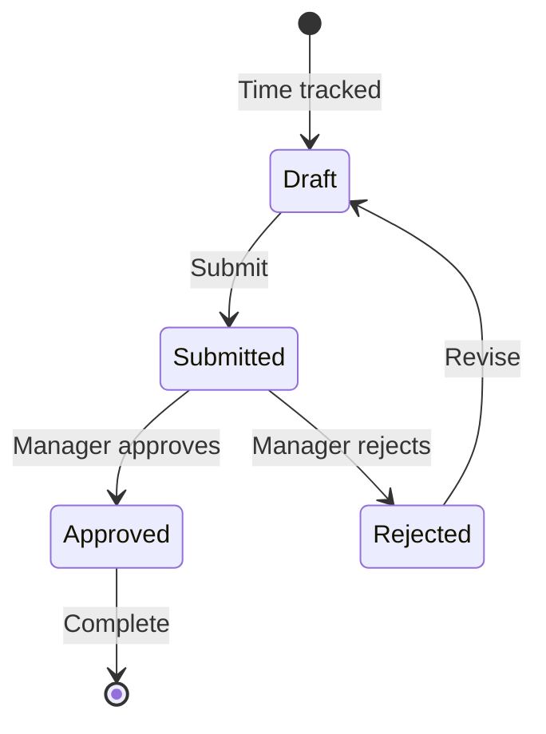

# Timesheet Management

Timesheets aggregate tracked time into structured reports that can be submitted, reviewed, and approved.

## Overview

The timesheet system provides:

- **Automatic aggregation** — Time logs are grouped into daily/weekly timesheets
- **Submission workflow** — Team members submit timesheets for review
- **Approval process** — Managers review and approve submitted timesheets
- **Export** — Export timesheets for payroll or billing

## Timesheet Structure

| Field           | Description                                    |
| --------------- | ---------------------------------------------- |
| **Period**      | Date range (daily, weekly, bi-weekly, monthly) |
| **Employee**    | Team member who tracked time                   |
| **Total hours** | Aggregated tracked time                        |
| **Tasks**       | Tasks worked on during the period              |
| **Projects**    | Projects associated with time entries          |
| **Status**      | Draft, Submitted, Approved, Rejected           |

## Workflow

### States

| Status        | Description                                       |
| ------------- | ------------------------------------------------- |
| **Draft**     | Time entries being accumulated, not yet submitted |
| **Submitted** | Submitted for review                              |
| **Approved**  | Approved by manager                               |
| **Rejected**  | Rejected with feedback, needs revision            |

## Views

### Employee View

- View your own timesheets
- Submit timesheets for approval
- See approval status and feedback

### Manager View

- Review submitted timesheets from team members
- Approve or reject with comments
- View team-wide timesheet status

## Filters

| Filter          | Options                                             |
| --------------- | --------------------------------------------------- |
| **Date range**  | Custom date range, this week, last week, this month |
| **Team member** | Filter by specific members                          |
| **Project**     | Filter by project                                   |
| **Status**      | Draft, Submitted, Approved, Rejected                |

## Related Hooks

| Hook                     | Purpose                       |
| ------------------------ | ----------------------------- |
| `useTimesheet`           | Timesheet data and operations |
| `useTimesheetFilters`    | Timesheet filtering           |
| `useTimesheetViewData`   | View-specific data            |
| `useTimesheetPagination` | Paginated timesheet data      |

## Related API Routes

| Route                     | Methods   | Purpose                            |
| ------------------------- | --------- | ---------------------------------- |
| `/api/timesheet`          | GET, POST | List and create timesheets         |
| `/api/timesheet/[action]` | POST      | Submit, approve, reject timesheets |
| `/api/timesheet/count`    | GET       | Timesheet count statistics         |
