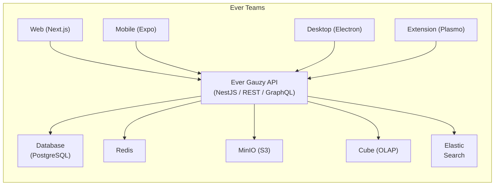

import ReactPlayer from "react-player/lazy";

# Ever Teams — Open Work and Project Management Platform

Welcome to the official **Ever® Teams™** documentation. Ever Teams is a comprehensive, open-source platform for **work management**, **time tracking**, **task & project management**, and **team collaboration** — built for modern teams who need real-time visibility into productivity and progress.

> **Real-Time Clarity, Real-Time Reality™** — Track the progress of your teams' work in real time.

<ReactPlayer
  url="https://www.youtube.com/watch?v=vfz1gQiM-VU"
  width="100%"
  height="450px"
/>

---

## Why Ever Teams?

Ever Teams provides an all-in-one solution that replaces the need for multiple disconnected tools. Whether you are a startup, a growing enterprise, or a distributed remote team, Ever Teams gives you:

- **Unified Workspace** — Manage tasks, track time, monitor productivity, and collaborate from a single platform.
- **Open Source** — Fully transparent, community-driven, and customizable to your needs (AGPL-3.0 license).
- **Cross-Platform** — Available on Web, Desktop (Windows, macOS, Linux), Mobile (iOS, Android), and Browser Extensions.
- **Self-Hostable** — Deploy on your own infrastructure with Docker, or use managed cloud deployments on Vercel, DigitalOcean, Render, Railway, and more.
- **Built on Ever Gauzy** — Leverages the powerful [Ever Gauzy](https://gauzy.co) Business Management Platform (ERP/CRM/HRM) as its backend.

---

## Key Features

### 🕐 Time Management

- **Real-time Timer** — Start/stop timers with one click, track time against tasks and projects.
- **Activity Tracking** — Monitor application & URL activity, screenshots, and idle detection.
- **Timesheet Management** — Submit, review, and approve timesheets with configurable workflows.
- **Time Limits & Budgets** — Set daily/weekly time limits and track against budgets.

### 📋 Task & Project Management

- **Task Management** — Create, assign, prioritize, and track tasks with custom statuses, sizes, and priorities.
- **Project Management** — Organize work into projects with dedicated views and settings.
- **Kanban Board** — Visual drag-and-drop task boards for agile workflows.
- **Calendar View** — Plan and visualize tasks on a calendar timeline.
- **Daily Plans** — Plan your day with structured daily task planning.
- **Issue Types & Labels** — Categorize with custom issue types, tags, and labels.

### 👥 Team Collaboration

- **Teams & Organizations** — Create and manage multiple organizations and teams.
- **Video Conferencing** — Built-in video meetings powered by Jitsi or LiveKit.
- **Roles & Permissions** — Granular role-based access control for team members.
- **Real-time Collaboration** — Collaborative features for team coordination.
- **Invite System** — Invite team members via email with configurable roles.

### 📊 Analytics & Reporting

- **Dashboard** — At-a-glance overview of team activity and metrics.
- **Activity Reports** — Detailed reports on time, tasks, and productivity.
- **Export** — Export data for external analysis.

### 🔗 Integrations

- **GitHub** — Sync issues and pull requests bidirectionally.
- **JIRA** — Import and sync issues from Atlassian JIRA.
- **GitLab, Bitbucket** — Additional VCS integrations (planned/available).

### 🎨 User Experience

- **Dark / Light / Black Themes** — Multiple theme options for comfortable work.
- **Internationalization** — Available in 13+ languages (English, French, Arabic, Bulgarian, Chinese, Dutch, German, Hebrew, Italian, Polish, Portuguese, Russian, Spanish).
- **Responsive Design** — Fully responsive web interface built with Tailwind CSS.

---

## Platform Overview

Ever Teams is available across multiple platforms:

| Platform              | Technology          | Description                                                             |
| --------------------- | ------------------- | ----------------------------------------------------------------------- |
| **Web App**           | Next.js (React)     | Full-featured web application at [app.ever.team](https://app.ever.team) |
| **Mobile App**        | Expo (React Native) | Native iOS and Android applications                                     |
| **Desktop App**       | Electron            | Desktop timer application for Windows, macOS, and Linux                 |
| **Browser Extension** | Plasmo              | Chrome/Firefox extension for quick time tracking                        |
| **Server Web**        | Electron + Next.js  | Self-contained web server distribution                                  |

---

## Ever Teams Kit

Beyond the standalone applications, **[Ever Teams Kit](./kit/index.md)** lets you embed work & time tracking **natively inside your own platform** using prebuilt components, SDKs, APIs, and widgets — Ever Teams Tracking-as-a-Service.

---

## Architecture at a Glance

---

## Quick Links

- 🌐 **Live Demo**: [demo.ever.team](https://demo.ever.team)
- 🧰 **Ever Teams Kit**: [ever.team/products/kit](https://ever.team/products/kit)
- 🚀 **Production App**: [app.ever.team](https://app.ever.team)
- 📦 **GitHub Repository**: [github.com/ever-co/ever-teams](https://github.com/ever-co/ever-teams)
- 💬 **Discord**: [Join our Discord](https://discord.gg/hKQfn4j)
- 📧 **Contact**: [ever.co/contacts](https://ever.co/contacts)

---

## Next Steps

Ready to get started? Head to the [Installation Guide](./getting-started/installation) to set up your development environment, or try the [Docker Quick Start](./deployment/docker-quick-start) for the fastest way to run Ever Teams.
