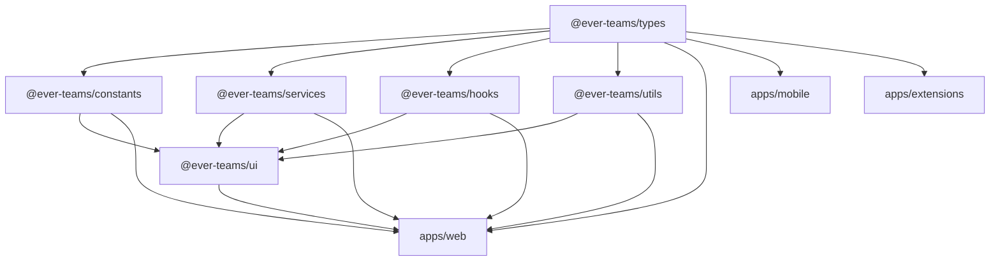

# Shared Packages

Ever Teams shares code across applications through a set of internal packages in the `packages/` directory. These packages are managed as Yarn workspace packages.

## Package Overview

| Package                                              | npm Name                    | Description                                    |
| ---------------------------------------------------- | --------------------------- | ---------------------------------------------- |
| [`packages/ui`](#ever-teamsui)                       | `@ever-teams/ui`            | Shared UI component library built on shadcn/ui |
| [`packages/services`](#ever-teamsservices)           | `@ever-teams/services`      | API service layer for backend communication    |
| [`packages/hooks`](#ever-teamshooks)                 | `@ever-teams/hooks`         | Reusable React hooks                           |
| [`packages/types`](#ever-teamstypes)                 | `@ever-teams/types`         | TypeScript type definitions                    |
| [`packages/constants`](#ever-teamsconstants)         | `@ever-teams/constants`     | Shared constants and enums                     |
| [`packages/utils`](#ever-teamsutils)                 | `@ever-teams/utils`         | Utility functions                              |
| [`packages/eslint-config`](#ever-teamseslint-config) | `@ever-teams/eslint-config` | Shared ESLint configuration                    |
| [`packages/ts-config`](#ever-teamsts-config)         | `@ever-teams/ts-config`     | Shared TypeScript compiler options             |

---

## @ever-teams/ui

The shared UI component library, built on top of [shadcn/ui](https://ui.shadcn.com) and [Radix UI](https://www.radix-ui.com).

### Features

- Pre-built, accessible UI components
- Tailwind CSS-based styling
- Customizable with CSS variables
- Tree-shakeable exports

### Components Include

- Buttons, inputs, selects, checkboxes
- Dialog, modal, popover, tooltip
- Table, data table, pagination
- Calendar, date picker
- Tabs, accordion, collapsible
- Card, badge, avatar
- Command palette, combobox
- Toast notifications
- And many more...

### Building

```bash
yarn build:ui
```

---

## @ever-teams/services

API service layer providing typed API methods for communicating with the Ever Gauzy backend.

### Modules

- **Auth** — Authentication and session management
- **User** — User profile operations
- **File** — File upload and management
- **Task** — Task CRUD operations
- **Projects** — Project management

### Building

```bash
yarn build:services
```

---

## @ever-teams/hooks

A library of reusable React hooks shared across applications.

### Building

```bash
yarn build:hooks
```

---

## @ever-teams/types

TypeScript type definitions shared across the entire monorepo.

### Building

```bash
yarn build:types
```

---

## @ever-teams/constants

Shared constants, enums, and configuration values.

### Building

```bash
yarn build:constants
```

---

## @ever-teams/utils

General-purpose utility functions.

### Building

```bash
yarn build:utils
```

---

## @ever-teams/eslint-config

Shared ESLint configuration extending standard and TypeScript rules.

---

## @ever-teams/ts-config

Shared TypeScript compiler options (`tsconfig.json`) used across all packages and apps.

---

## Dependency Graph



## Building All Packages

```bash
# Build all packages in dependency order
yarn build

# Build specific package
yarn build:ui
yarn build:services
yarn build:types
yarn build:constants
yarn build:hooks
yarn build:utils
```
